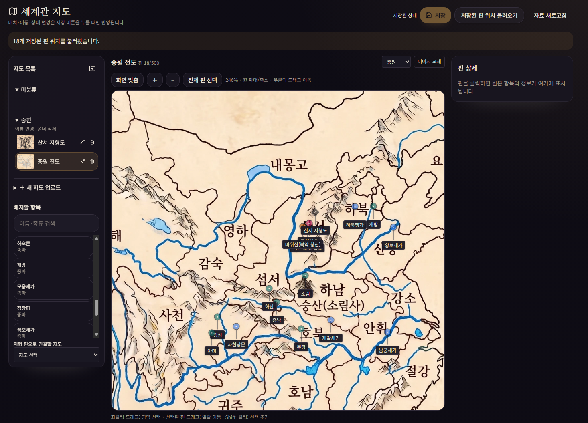
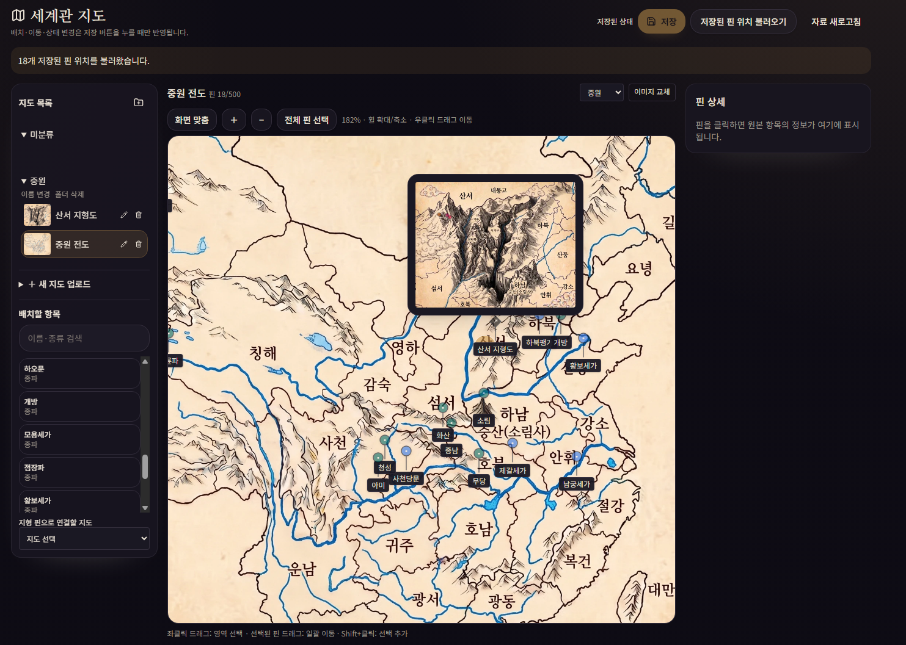

# Muse Novel

한국어 소설 집필을 위한 로컬 우선 AI 작업실입니다. 아이디어를 스토리 기획으로 정리하고, 등장인물·세계관·지도·챕터를 연결한 뒤 집필과 설정 검토를 한 곳에서 이어갈 수 있습니다.

Muse Novel은 LLM이나 GPU를 직접 관리하는 올인원 패키지가 아닙니다. 웹 서버가 프롬프트 구성, 검색, 승인·거부, 저장, 타임아웃, 대기열을 담당하고, LLM·이미지 생성기·검색기는 규격화된 HTTP API로 연결합니다. 따라서 WSL의 llama.cpp, Ollama, OpenAI 호환 서버 등 어떤 모델을 사용하든 API 주소와 모델 ID만 바꾸면 됩니다.

## 한눈에 보는 기능

### 집필과 스토리 기획

- 소설 프로젝트, 챕터, 등장인물, 세계관 항목을 프로젝트별로 관리
- 챕터 자동 저장과 브라우저 복구본
- AI 보조 작성, Ghost Text 자동완성, 명령형 편집
- 홈 화면 스토리 구상 탭에서 대화로 제목·장르·시놉시스·인물·세계관·1장 개요 생성
- 기획 초안을 검토한 뒤 새 프로젝트로 일괄 적용
- 문체·필력·일관성 유지를 위한 프로젝트 설정, 작가 메모, 창작 위키·참조 지식
- 기존 항목을 수정할 때 영향받을 수 있는 다른 설정을 검토하고 이전 버전으로 복원
- 카테고리 특성에 연결된 캐릭터 소속·직위와 회차별 변화 이력
- 회차별 등장인물·장소·물건·단체의 직접 등장/언급 목록
- 집필 중 세계관 항목 미리보기와 저장된 핀을 표시하는 읽기 전용 미니맵 패널
- 프로젝트별 Ghost Text 켜기/끄기와 중간 커서 위치 보존

### 세계관 자동 구축과 검색

- 세계관 카테고리를 직접 추가·이름 변경·삭제
- World assistant에서 “중원 무협의 대표 종파 5대 세가와 9파 1방을 조사해 후보로 만들어줘”처럼 요청
- 내부 세계관·창작 위키를 먼저 확인하고, 정보가 부족할 때만 SearXNG 검색
- 검색 출처는 접을 수 있는 드롭다운으로 확인
- 후보를 항목별 또는 일괄 승인·거부한 뒤 승인한 항목만 실제 데이터에 반영
- 요청 수량, 기존 항목, 대기 후보, 누락 수량을 검증하여 일부만 생성되는 문제를 표시
- 나무위키, 디시인사이드 장르소설 갤러리, 아카라이브 소설 채널, World Anvil, Story Plotter, Wikipedia, Baidu Baike, 중국 사서·지도 자료를 확장 가능한 출처 목록으로 관리

### 세계관 지도

아래 화면은 현재 지도 작업 공간의 예시입니다.





이미지에서 볼 수 있듯이 지도 탭에서는 다음 작업을 할 수 있습니다.

- PNG/JPG/WebP 지도를 등록하고 표시용·고해상도용·썸네일 WebP로 자동 최적화
- 지도 폴더 생성·이름 변경·삭제, 지도 목록에서 폴더로 드래그 이동
- `화면 맞춤`, 확대·축소, 우클릭 팬, 좌클릭 마퀴 선택, Shift 다중 선택
- 세계관·캐릭터를 목록에서 드래그하거나 항목 선택 후 지도 클릭으로 핀 배치
- 같은 항목을 여러 번 배치하고 여러 핀을 함께 이동·삭제
- 핀 머리 색상 지정, 기본 5색 + 사용자 색상 최대 7개 팔레트, 비활성 핀 표시
- 핀 클릭 시 원본 항목의 정보·태그·출처·관련 항목을 우측 상세에 표시
- `원본 항목 수정`으로 캐릭터/세계관 수정 폼을 재사용해 바로 수정
- 다른 지도에 연결하는 지형 핀, 썸네일 미리보기, 연결 지도 이동, 끊어진 링크 복구
- 지도별 저장된 좌표 자동 로드와 `저장된 핀 위치 불러오기`
- 저장 전 브라우저 초안으로 편집하고 상단 `저장`에서 한 번에 SQLite 트랜잭션 반영
- 지도당 최대 500핀, 확대할수록 풀리는 주변 핀 클러스터와 요약 팝업
- 지도 화면의 World assistant 리모콘을 클릭해 지도 배치용 세계관 항목을 승인·추가

지도 사용 세부사항은 [세계관 지도 문서](docs/wiki/World-Maps.md)를 참고하세요.

### 이미지·LoRA

- 프로젝트별 Diffusers 또는 Automatic1111/Forge 이미지 API 연결
- 캐릭터 profile/full-body/illustration 프리셋과 네거티브 프롬프트
- 한국어 설명에서 이미지 태그 추천·번역
- LoRA 외부 API 등록과 연결 테스트

## 현재 상태와 다음 작업

현재 Ghost Text 자동완성은 기본 연결과 동작 실험 단계로, 아직 완성된 기능이 아닙니다. 문맥에 맞지 않는 반복, 문체·필력 변화, 긴 이야기에서의 설정 불일치, 응답 지연과 취소 처리 등을 더 개선해야 합니다. 다음 개발에서는 Ghost Text 품질 고도화를 우선순위로 두고 다음 항목을 진행할 예정입니다.

- 현재 문장과 장면 목적에 맞춘 짧고 자연스러운 실시간 제안
- 작가의 문체·금지 표현·시점·대사 비율을 유지하는 스타일 컨텍스트
- 최근 원고뿐 아니라 등장인물 상태, 소지품, 기술, 관계, 복선을 검색하는 메모리 연결
- 반복·상투 표현 억제, 제안 취소·재요청, 지연시간과 생성 길이 최적화
- Ghost Text 전용 소형 또는 MoE 모델을 OpenAI 호환 API로 교체할 수 있는 구성

LoRA와 이미지 생성은 현재 외부 API 등록·연결 테스트 및 일부 캐릭터 프리셋을 중심으로 구성되어 있습니다. 이후에는 다음 기능을 실제 제작 흐름에 맞게 구현할 예정입니다.

- 프로젝트와 캐릭터별 LoRA 선택, 가중치 조절 및 이미지 생성 요청에 실제 적용
- 캐릭터 초상화·전신·삽화 생성과 결과 이력·대표 이미지 선택
- 도시, 종파, 건물, 던전, 자연 지형 등 세계관 항목별 이미지 생성
- 기존 세계관 지도의 특정 영역이나 지형 설명을 참고한 이미지 생성
- 동일 캐릭터와 장소의 외형 일관성을 유지하는 프롬프트·시드·LoRA 프리셋
- 생성 결과 승인·거부, 재생성, 프로젝트 자료와 지도 핀 상세에 연결

따라서 현재 버전은 스토리 구상, 세계관 관리, 지도와 핀 배치, 원고 작성 기반을 먼저 사용하는 단계이며, Ghost Text·LoRA 적용·캐릭터/지형 이미지 생성은 계속 확장되는 기능으로 봐 주세요.

## 실행 구조

```text
브라우저
  │
  ▼
Muse Novel 웹 서버 (Next.js)
  ├─ 인증·프로젝트·원고·세계관·지도 DB
  ├─ 프롬프트·검색·에이전트 루프·승인/거부·대기열
  ├─ SearXNG / 이미지 API / 태그 API 호출
  └─ OpenAI 호환 LLM API 호출
          │
          └─ WSL llama.cpp·Ollama·외부 API 등
```

LLM 서버는 추론만 제공합니다. 검색이나 웹 페이지 방문, 에이전트 루프, 원고 저장을 LLM 서버에 설치하지 않습니다. 공통 규격은 다음과 같습니다.

| 기능 | 필수 API |
| --- | --- |
| 연결 확인 | `GET /health` |
| 모델 확인 | `GET /v1/models` |
| 스토리·세계관 생성 | `POST /v1/chat/completions` |
| Ghost Text | `POST /v1/completions` |

## 처음 설치하기

### 방법 A: 로컬 개발 실행

요구 사항은 Node.js 20 이상과 Bun 1.3 이상입니다.

```bash
git clone https://github.com/organic4597/Muse-Novel.git
cd Muse-Novel
bun install
cp .env.example .env.local
bun dev
```

Windows PowerShell에서는 다음처럼 환경 파일을 복사할 수 있습니다.

```powershell
Copy-Item .env.example .env.local
bun install
bun dev
```

브라우저에서 `http://localhost:3000`을 엽니다. SQLite는 기본적으로 `data/sqlite.db`, 인증 파일은 `data/auth`에 만들어집니다. 이 두 경로를 삭제하거나 임시 폴더로 바꾸면 기존 계정과 데이터가 사라질 수 있으므로 백업 대상에 포함하세요.

### 방법 B: Docker 운영 실행

```bash
git clone https://github.com/organic4597/Muse-Novel.git
cd Muse-Novel
cp .env.example .env
docker build -t muse-novel:latest .
docker volume create muse-novel-data
docker run -d --name muse-novel --restart unless-stopped \
  -p 3210:3000 \
  --env-file .env \
  -v muse-novel-data:/app/data \
  muse-novel:latest
```

처음에는 `http://localhost:3210`으로 접속합니다. 운영 환경에서는 `muse-novel-data:/app/data`를 반드시 유지하세요. 컨테이너를 교체해도 SQLite DB, 업로드 이미지, 로그인 자격 증명이 보존됩니다.

## 로그인과 최초 설정

로그인에서 가장 많이 헷갈리는 부분은 **초기 설정 코드와 관리자 비밀번호가 서로 다른 값**이라는 점입니다.

### 초기 설정 코드 만들기

`MUSE_AUTH_SETUP_TOKEN`은 공개된 네트워크에서 다른 사람이 먼저 관리자 계정을 만들어 버리는 것을 막는 배포용 코드입니다. Muse Novel이 화면에 임의의 코드를 보여주는 것이 아니라, **서버를 처음 실행할 사람이 직접 생성해서 환경 변수에 넣어야 합니다.**

Linux, macOS, WSL에서는 다음 명령으로 64자리 무작위 코드를 만들 수 있습니다.

```bash
openssl rand -hex 32
```

Windows PowerShell에서는 다음 명령을 사용합니다.

```powershell
[Convert]::ToHexString([Security.Cryptography.RandomNumberGenerator]::GetBytes(32)).ToLower()
```

출력된 값을 복사해서 로컬 실행은 `.env.local`, Docker 실행은 `.env`에 다음처럼 넣습니다. 아래 예시 문구를 그대로 사용하면 안 됩니다.

```dotenv
MUSE_AUTH_SETUP_TOKEN=<방금 생성한 64자리 무작위 코드>
```

환경 파일은 Git에 커밋하지 않습니다. 저장소는 `.env`와 `.env.*`를 무시하고 `.env.example`만 예제로 추적합니다. Docker에서는 `--env-file .env`를 사용하고, 값을 추가하거나 바꿨다면 컨테이너를 다시 만들어야 적용됩니다.

### 최초 계정 만들기

1. 최초 접속 시 인증 계정이 없으면 자동으로 `/setup`으로 이동합니다.
2. 배포 전에 `MUSE_AUTH_SETUP_TOKEN`을 설정했다면 `/setup`의 `초기 설정 코드` 칸에 환경 파일에 넣은 64자리 값을 그대로 입력합니다. 이것은 관리자 계정을 처음 만드는 보호 코드이며 로그인 비밀번호가 아닙니다.
3. `관리자 아이디`를 정합니다. 기본 입력값은 `admin`입니다.
4. 12자 이상의 새 비밀번호와 비밀번호 확인을 입력하고 `관리자 설정 완료`를 누릅니다.
5. 이후에는 `/login`에서 방금 만든 아이디와 비밀번호로 로그인합니다.
6. 로그인 후 우측 상단 로그아웃 버튼으로 세션을 종료할 수 있습니다.

초기 설정 코드를 지정하지 않으면 코드 입력칸 자체가 나타나지 않습니다. 개인 PC의 로컬 접속에는 가능하지만, LAN이나 외부에서 접근 가능한 서버에서는 다른 사람이 먼저 `/setup`을 완료할 수 있으므로 반드시 코드를 설정하세요.

`MUSE_AUTH_SETUP_TOKEN`은 계정 생성이 끝난 뒤 컨테이너 환경에서 제거해도 됩니다. 이 값은 로그인할 때 다시 쓰지 않으며 관리자 아이디·비밀번호를 대신하지 않습니다. 이미 계정이 만들어진 상태에서 `/setup`으로 들어가면 로그인 화면으로 돌아갑니다.

비밀번호는 원문으로 저장되지 않고 사용자별 무작위 salt와 scrypt로 해시됩니다. 세션은 HttpOnly 쿠키로 보호되며 반복 실패는 점진적으로 제한됩니다. 현재 HTTP로 운영한다면 신뢰할 수 있는 내부망에서만 사용하고, 외부 공개가 필요하면 TLS 리버스 프록시를 추가하세요. 자세한 내용은 [로그인과 운영 보안](docs/wiki/Security.md)에 있습니다.

### 로그인 문제 해결

| 증상 | 확인할 것 |
| --- | --- |
| `/setup`이 안 보임 | `data/auth/credential.json`이 이미 존재하는지 확인하고, 기존 계정으로 `/login` 시도 |
| 초기 설정 코드 입력칸이 안 보임 | 서버 환경에 `MUSE_AUTH_SETUP_TOKEN`이 없거나 빈 값입니다. LAN 배포라면 값을 추가하고 서버/컨테이너를 다시 시작 |
| 초기 설정 코드 오류 | `.env`의 `MUSE_AUTH_SETUP_TOKEN`과 입력값이 정확히 같은지 확인. 따옴표나 앞뒤 공백을 함께 복사하지 않았는지 확인 |
| 계속 로그인 화면으로 돌아감 | `/app/data` 볼륨이 유지되는지, `data/auth` 권한과 컨테이너 로그 확인 |
| 비밀번호를 잊음 | 복구 기능은 없으므로 DB와 인증 디렉터리를 백업한 뒤 운영 절차에 따라 인증을 초기화. 데이터 디렉터리 전체 삭제는 먼저 백업 |
| `허용되지 않은 요청 출처` | 접속 주소와 브라우저 주소의 프로토콜·호스트·포트가 같은지 확인. 신뢰 프록시를 사용할 때만 `AUTH_TRUST_PROXY=1` |

## LLM 연결

### ChatGPT 계정으로 연결하기 (API 키 없이 · 실험 기능)

`AI 환경`에서 **ChatGPT 계정 연결 (API 키 없음)** 또는 작품별 **ChatGPT 계정** 탭을 선택하세요. **ChatGPT로 로그인**을 누른 뒤 OpenAI 공식 페이지에서 일회용 코드를 입력합니다. 로그인 완료 후 모델을 선택하고 **공통 기본 AI로 사용** 또는 **이 작품의 기본 AI로 사용**을 누릅니다. 기존 API 제공자 설정은 보존됩니다.

Docker 이미지에는 Codex CLI `0.153.4`가 포함됩니다. 직접 실행하는 환경은 `npm install -g @openai/codex@0.153.4`로 설치하거나 `MUSE_CODEX_BIN`에 실행 파일 경로를 지정하세요. 자세한 인증·호환 범위는 [ChatGPT 계정 연결](docs/wiki/ChatGPT-Connection.md)을 참고하세요. 실제 인증은 사용자가 직접 완료해야 합니다.

이 방식은 ChatGPT의 Codex 사용 한도를 소비하며 별도 API 키 과금으로 자동 전환하지 않습니다. 기존 텍스트·JSON·스트리밍 요청 인터페이스를 재사용하지만 모델 목록과 생성 옵션은 Codex 지원 범위를 따릅니다. HTTP 추론 서버 대신 웹 서버 안의 격리된 Codex App Server를 사용하고, 자료 조회·검색·승인·저장은 여전히 Muse Novel이 담당합니다.

### 1. WSL llama.cpp / SuperQwen 연결

LLM 서버가 WSL에서 실행 중이고 Windows에서 Muse Novel을 실행한다면 `localhost`가 서로 다른 네트워크 네임스페이스를 가리킬 수 있습니다. Muse Novel이 실행되는 환경에서 실제로 접근 가능한 주소를 사용하세요.

예시:

```text
Base URL: http://127.0.0.1:8080
Model ID: /v1/models 응답의 id 값 또는 서버 alias
API Key: 서버가 요구할 때만 입력
```

Docker 컨테이너에서 WSL의 LLM을 부를 때는 컨테이너 내부의 `127.0.0.1`이 LLM이 아니라 컨테이너 자신을 가리킵니다. 같은 Docker 네트워크에 넣거나, 호스트 게이트웨이 주소를 사용하고 llama-server가 외부 인터페이스에서 수신하도록 설정하세요. LLM 서버를 `0.0.0.0`에 공개할 때는 신뢰된 LAN에서만 사용하고 방화벽으로 접근 범위를 제한하세요.

### 2. 설정 화면에서 등록

1. 로그인 후 상단 `AI 환경`으로 이동합니다.
2. 전역 AI 설정에서 `OpenAI 호환 Local LLM` 또는 원하는 provider를 선택합니다.
3. Base URL, 정확한 Model ID, 필요 시 API Key와 컨텍스트 길이를 입력합니다.
4. `연결 테스트`로 `/health`와 `/v1/models` 응답을 확인합니다.
5. 프로젝트별 AI 설정이 있으면 해당 설정이 전역 설정을 우선할 수 있으므로 프로젝트 화면에서도 확인합니다.

스토리 구상·세계관 자동 구축·일반 집필은 `/v1/chat/completions`, Ghost Text는 `/v1/completions`를 사용합니다. 모델을 바꿔도 검색·에이전트·저장 로직은 웹 서버에 남아 있어 같은 API 계약을 유지합니다.

### 3. 대표 환경 변수

`.env.local` 또는 Docker 환경에 필요한 값만 설정합니다.

```dotenv
DATABASE_PROVIDER=sqlite
DATABASE_URL=./data/sqlite.db
MUSE_AUTH_SETUP_TOKEN=첫_관리자_생성용_긴_무작위_값
QWEN_LOCAL_URL=http://127.0.0.1:8080
AI_LOCAL_CONCURRENCY=1
AI_LOCAL_MAX_QUEUE_SIZE=24
```

`QWEN_LOCAL_URL`은 설정 화면에 저장된 값이 없을 때 사용하는 fallback입니다. 연결 테스트가 성공해도 모델 ID가 실제 `/v1/models`의 ID와 다르면 추론이 실패하므로 그대로 복사해 입력하세요. LLM이 느린 경우 서버가 정한 대기열·10분 전체 타임아웃·재시도 정책이 적용됩니다.

### 4. SearXNG 웹 검색 연결

검색은 LLM이 직접 수행하지 않고 Muse Novel 웹 서버가 SearXNG에 요청합니다.

1. SearXNG의 JSON format을 활성화합니다.
2. `AI 환경 → 공통 연결 → 웹 검색`에서 SearXNG Base URL을 저장합니다.
3. `연결 테스트`를 실행합니다.
4. 자동 검색을 `필요할 때 자동`, `항상 검색`, `끄기` 중 선택합니다.

Docker 네트워크에서 사용할 때 예시 주소는 `http://muse-search:8080`이며, `WEB_SEARCH_URL` 환경 변수로도 지정할 수 있습니다. 검색 결과는 요약과 출처로만 모델에 전달되고, 승인 전 후보는 실제 세계관 데이터에 저장되지 않습니다.

## 데이터·백업·업데이트

- SQLite DB: `data/sqlite.db` 또는 Docker `/app/data/sqlite.db`
- 로그인 자격 증명·세션 비밀: `data/auth`
- 업로드 이미지: `data/uploads`
- 창작 위키: `knowledge/writing`
- 웹 검색 출처 목록: `knowledge/web-research/sources.json`

운영 백업은 `/app/data` 전체와 외부 위키·출처 파일을 함께 보관하세요. 새 버전으로 컨테이너를 교체할 때는 같은 영구 볼륨을 연결하고, `/api/health`에서 `database: ok`를 확인한 후 사용합니다. 지도 핀은 저장 버튼을 누르기 전까지 초안이므로, 배포·새로고침 전에 저장 여부를 확인하세요.

## 개발 명령

```bash
bun run typecheck       # TypeScript
bun run lint            # Biome + ESLint
bun run test            # Vitest
bun run test:e2e        # Playwright
bun run build           # DB migration 후 Next build
bun run knowledge:sync  # 창작 지식 동기화
bun run knowledge:audit # 창작 지식 점검
```

개발 서버는 기본적으로 `http://localhost:3000`, Docker 예시는 `http://localhost:3210`입니다. GPU·Python·llama-server는 Muse Novel의 시작/종료 책임이 아니며, 연결된 외부 API가 준비되어 있어야 합니다.

## 문서 바로가기

- [위키 홈](docs/wiki/Home.md)
- [설치 및 최초 로그인](docs/wiki/Getting-Started.md)
- [집필 작업실](docs/wiki/Writing-Workspace.md)
- [세계관 구축](docs/wiki/World-Building.md)
- [세계관 지도](docs/wiki/World-Maps.md)
- [로그인과 운영 보안](docs/wiki/Security.md)
- [AI 연결과 모델 설정](docs/wiki/AI-Configuration.md)
- [AI 웹 조사와 SearXNG](docs/wiki/Web-Research.md)
- [이미지 생성과 LoRA](docs/wiki/Image-Generation.md)
- [외부 API 계약](docs/wiki/External-Services.md)
- [스토리 구상](docs/wiki/Story-Planning.md)
- [운영·백업·업데이트](docs/wiki/Operations.md)
- [브랜치와 릴리즈 운영](docs/wiki/Branching-and-Release.md)
- [아키텍처](docs/wiki/Architecture.md)

## 라이선스

저장소의 [LICENSE](LICENSE)를 따릅니다.
